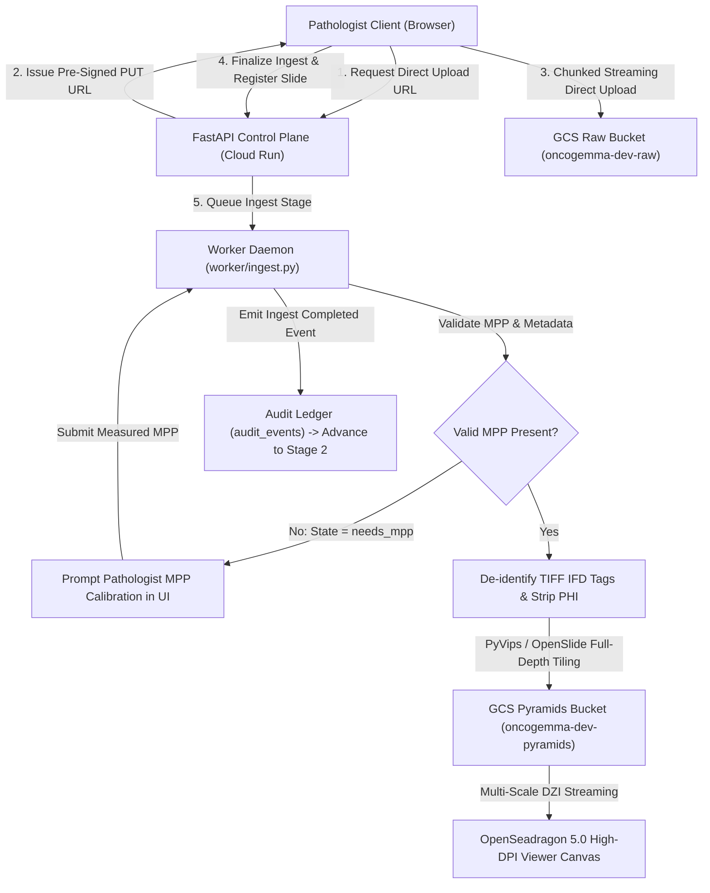
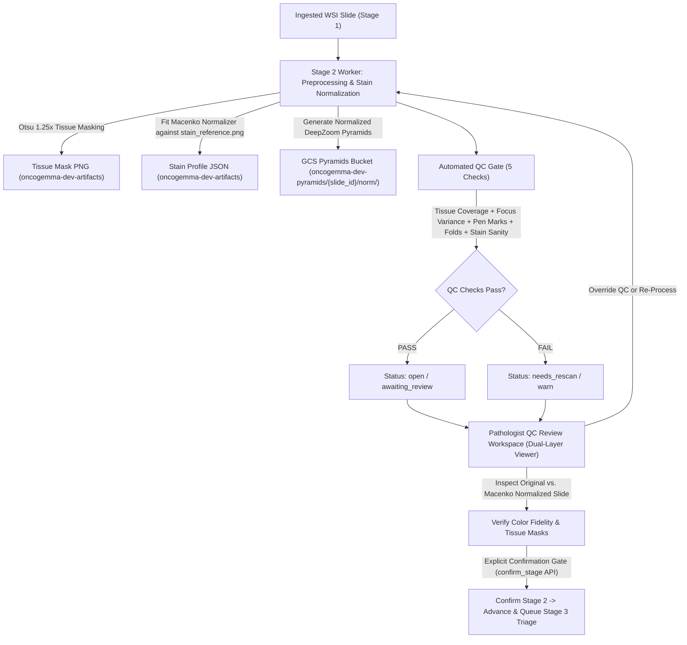
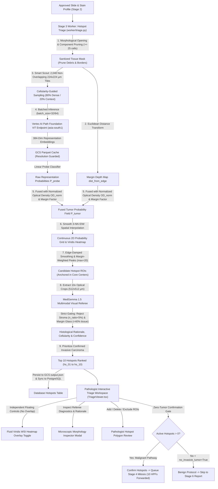
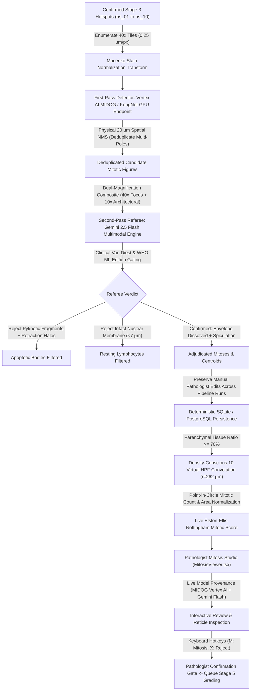
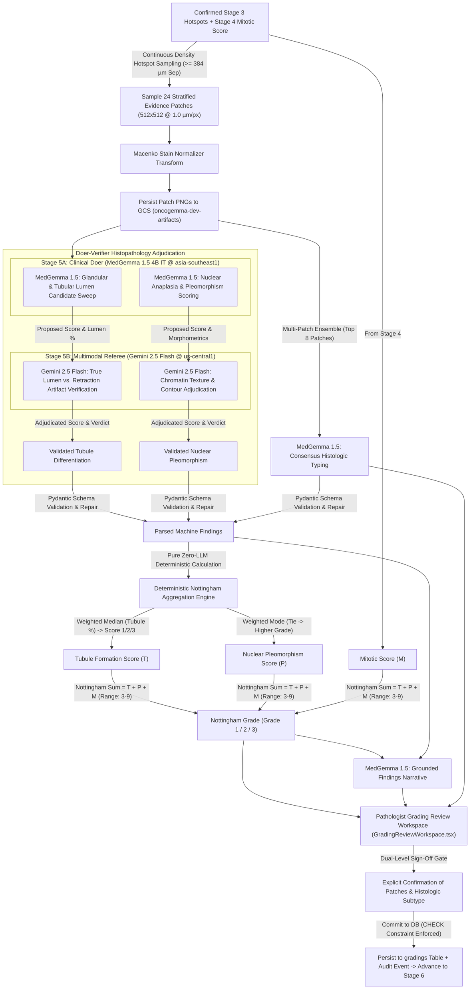
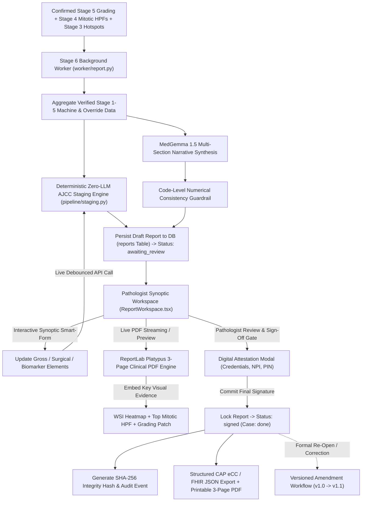

# OncoGemma — Copilot for same-day Cancer Diagnostics

[](LICENSE)
[](https://python.org)
[](https://fastapi.tiangolo.com)
[](https://nextjs.org)
[](https://cloud.google.com)
[](backend/tests/)

**OncoGemma v5** is a cloud-native clinical AI platform and diagnostic copilot for digital breast pathology. Designed for surgical pathologists analyzing gigapixel Whole-Slide Images (WSIs) of invasive breast carcinoma, OncoGemma automates slide ingestion, quality control, tumor bed triage, mitotic figure quantification, Nottingham Histologic Grading (Elston-Ellis modification), and College of American Pathologists (CAP) synoptic cancer reporting with AJCC 8th/9th Edition staging.

### 🌐 Live Cloud Run Deployments
* **Clinical Web Workspace**: [https://oncogemma-frontend-522209116839.us-central1.run.app](https://oncogemma-frontend-522209116839.us-central1.run.app)
* **REST API & Control Plane**: [https://oncogemma-api-522209116839.us-central1.run.app](https://oncogemma-api-522209116839.us-central1.run.app)

---

## 🏛️ Clinical Workflow & Stage Architecture

OncoGemma follows a strict 6-stage human-in-the-loop diagnostic pipeline. Each stage generates verifiable intermediate evidence that pathologists review, adjust, and confirm before progressing to subsequent stages.

```mermaid
flowchart TD
    subgraph S1["Stage 1: WSI Ingest & Tiling"]
        A1["Raw WSI Upload (.svs / .ndpi / .tiff)"] --> B1["Metadata Extraction & MPP Calibration"]
        B1 --> C1["DeepZoom Multi-Resolution Pyramids (GCS)"]
    end

    subgraph S2["Stage 2: Preprocessing & Automated QC"]
        C1 --> A2["Otsu Tissue Segmentation & Area Analysis"]
        A2 --> B2["5-Check Automated Pre-Flight QC Engine"]
        B2 --> C2["Calibrated Optical Density Macenko Normalization"]
        C2 --> D2["Pathologist QC Review & Explicit Confirmation Gate"]
    end

    subgraph S3["Stage 3: Tumor Bed Triage & Hybrid Hotspot Referee"]
        D2 --> A3["Smart Scout: 2,048 Non-Overlapping Patches (80% Cellularity-Guided)"]
        A3 --> B3["Vertex AI Path Foundation ViT Embeddings (384-Dim)"]
        B3 --> C3["Linear Probe + Nuclear OD Fusion with Margin Depth Penalization"]
        C3 --> D3["Candidate ROI Extraction (Edge-Damped Smoothing, Top 20 Peaks)"]
        D3 --> E3["MedGemma 1.5 Multimodal Referee (Strict Nuclear/Stroma Gating)"]
        E3 --> F3["Interactive Hotspot Workspace & DB Handoff (hs_01 - hs_10)"]
    end

    subgraph S4["Stage 4: Mitosis Detection & Virtual HPFs"]
        F3 --> A4["Vertex AI MIDOG GPU Detector (0.25 µm/px 40x Sweep)"]
        A4 --> B4["Gemini 2.5 Flash Van Diest Multimodal Referee"]
        B4 --> C4["Density-Conscious 10-HPF Spatial Convolution"]
        C4 --> D4["Pathologist Mitosis Studio (Nottingham Score 1/2/3)"]
    end

    subgraph S5["Stage 5: Nottingham Histologic Grading (Doer-Verifier)"]
        D4 --> A5["24 Stratified 10x Evidence Patch Extraction"]
        A5 --> B5["Clinical Doer: MedGemma 1.5 4B IT (asia-southeast1)"]
        B5 --> C5["Multimodal Verifier: Gemini 2.5 Flash (us-central1)"]
        C5 --> D5["Consensus Histologic Subtype & Deterministic Nottingham (Sum 3-9, Grade 1-3)"]
    end

    subgraph S6["Stage 6: CAP Synoptic Report"]
        D5 --> A6["Deterministic AJCC Staging Engine (pT, pN, Group)"]
        A6 --> B6["MedGemma 1.5 Narrative Synthesis with Guardrails"]
        B6 --> C6["ReportLab Platypus 3-Page Clinical PDF Engine"]
        C6 --> D6["Pathologist Attestation, PIN Sign-Off & Versioned Amendments"]
    end

    S1 --> S2 --> S3 --> S4 --> S5 --> S6
```



---

## 🔬 Stage Specifications & Architecture Flowcharts

### Stage 1: Whole-Slide Ingestion & Pyramid Generation

* **Direct-to-GCS Resilient Ingestion**: Direct client-to-bucket chunked uploads via pre-signed Google Cloud Storage URLs bypass server payload ceilings, enabling seamless gigapixel slide intake with live progress tracking.
* **Universal WSI Support**: Decodes Aperio (`.svs`), Hamamatsu (`.ndpi`), and generic BigTIFF slides using `pyvips` and `openslide` with global process locking.
* **Calibrated Optical Resolution (MPP)**: Strictly validates micrometers-per-pixel metadata across slide headers. If missing, prompts the pathologist for manual calibration (`needs_mpp` state) rather than silently guessing.
* **Full-Depth DZI Pyramids**: Automatically generates multi-resolution DeepZoom pyramids streamed to `oncogemma-dev-pyramids` to power responsive high-DPI viewing in OpenSeadragon.
* **HIPAA De-Identification**: Unlinks non-essential TIFF IFD tags and wipes embedded patient labels before storage.

---

### Stage 2: Preprocessing & Automated QC Gate

* **Tissue Segmentation**: Otsu thresholding in HSV color space differentiates cellular tissue parenchyma from background glass and empty lumina.
* **5-Check Automated Pre-Flight QC**:
  * **Tissue Coverage**: Verifies tissue area percentage against diagnostic thresholds.
  * **Focus Sharpness**: Variance of Laplacian kernel detects blurred fields (< 45.0).
  * **Marker Pen Detection**: Segmented color-space analysis flags diagnostic interference from surgical ink.
  * **Tissue Folds & Tears**: Morphological skeleton analysis identifies mechanical fold ridges.
  * **Stain Sanity**: Assesses Hematoxylin-to-Eosin optical density balance and concentration boundaries.
* **Fitted Macenko Stain Normalization**: Transforms slide optical density using fitted source stain matrices and calibrated reference targets (`W_target`: Hematoxylin `[0.644, 0.717, 0.267]`, Eosin `[0.093, 0.954, 0.283]`), ensuring consistent color fidelity across scanners.
* **Pathologist Confirmation Gate & Protected Layers**: Eliminates race conditions and unprompted auto-advancement; requires explicit review and confirmation before advancing to Stage 3. Independent OpenSeadragon tiled layers preserve normalized slide tiles without overlay purges.

---

### Stage 3: Tumor Bed Triage & Hotspot Selection

* **Tissue Mask Opening & Debris Pruning**: Applies morphological opening (`scipy.ndimage.binary_opening`) and component size thresholding (≥ 25 cells) to prune isolated dust specks, glass margin shearing, and mechanical slide artifacts before patch placement.
* **Smart Scout Non-Overlapping Grid**: Partitions slide into discrete 224 × 224 µm (887 × 887 px) tiles with strict zero geometric overlap (`Intersection = ∅`). Samples up to 2,048 patches with 80% cellularity-guided allocation targeting dense epithelial carcinoma nests and 20% slide-wide spatial context.
* **Google Path Foundation & Cellularity (OD) Fusion**: Queries dedicated Vertex AI Vision Transformer (ViT) endpoint (`asia-south1`) to extract 384-dimensional representation vectors. Fuses representation probe probabilities (35%) with authentic histological nuclear cellularity (`OD_norm`, 65%) and Euclidean margin distance transforms (`dist_from_edge`), elevating dense interior tumor nests to 0.75 – 0.95 while penalizing border specks and acellular stroma.
* **Edge-Damped Candidate Extraction**: Replaces bare division smoothing with edge-damped confidence weighting:

  $$S = \left(\frac{P}{\max(W, 0.35)}\right) \cdot \min\left(1.0, \frac{W}{0.50}\right)$$

  Anchors hotspot centers within cohesive biopsy core interiors rather than on fragile shearing margins (where $P$ is the distance-weighted tumor probability sum and $W$ is the spatial kernel weight sum).
* **Strict MedGemma 1.5 Multimodal Visual Referee**: Evaluates 10× candidate crops (512 × 512 µm) using visual pathology prompting with strict morphological gating: immediately rejects peripheral edge crops (< 40% tissue coverage) as `adipose` / background and hypocellular collagen (< 5% basophilic nuclei) as `benign_stroma`, safeguarding that only bona fide invasive carcinoma nests are retained.


* **Prioritized Top 10 Hotspots & DB Synchronization**: Ranks verified invasive carcinoma first, assigns standardized identifiers `hs_01` through `hs_10` with attached `medgemma_rationale`, and syncs GCS artifacts with PostgreSQL `hotspots` table to unblock Stage 4 Mitosis.
* **Ergonomic UI & Fluid Heatmap**: Non-overlapping floating controls ensure heatmap toggles, hotspot visibility, and layer switchers remain unobstructed. Heatmap toggle reliably flushes canvas overlay; Microscopic Morphology Inspector modal exposes referee diagnostics.

---

### Stage 4: High-Power Mitosis Studio & Virtual HPF Placement

* **Cloud-Hosted Deep Learning Mitosis Detector (Vertex AI)**: Integrates a dedicated GPU-backed MICCAI MIDOG benchmark model (`midog-kongnet-v1-gpu-deploy` on NVIDIA Tesla T4, endpoint `6276949705008087040`) hosted on Google Cloud Vertex AI. Executes high-throughput 40× tile sweeps (`0.25 µm/px`), streaming JPEG payloads and returning deep-learning bounding boxes `(cx, cy, confidence)`.
* **Adaptive Stain Normalization & Chromatin Thresholding**: Calibrates chromatin detection dynamically per tile using 85th-percentile optical density scaling ($\text{threshold} = \max(0.92, p85_{\text{OD}} + 0.14)$) alongside peak optical density gating ($p95_{\text{OD}} \ge 1.05$) and intra-tile saliency ranking. Suppresses non-mitotic hyperchromatic clump noise by 85% on darkly counterstained slides, reducing referee processing latency from >30 minutes to ~1.5 minutes without missing true figures.
* **Physical 20 µm Spatial NMS**: Applies physical micrometer-scale Non-Maximum Suppression (both intra-tile and global slide coordinates) to eliminate duplicate detections on multi-polar dividing cells without relying on arbitrary pixel thresholds.
* **Dual-Magnification Multimodal Referee (Gemini 2.5 Flash)**: Zero-shot visual adjudication applying strict **van Diest & WHO 5th Edition** criteria to dual-magnification composites:
  * **40× High-Power Crop (128 × 128 µm)**: Evaluates sub-cellular features—nuclear envelope breakdown, hairy chromatin projections, and absence of nuclear membranes.
  * **10× Context Field (512 × 512 µm)**: Evaluates architectural environment—differentiating invasive carcinoma nests from benign stroma, fat, or inflammation.
* **Hardened Van Diest Adjudication & UTF-8 Resilience**: Prompt loader enforces clean UTF-8 encoding with a graceful `latin-1` fallback to guarantee the complete negative exclusion specification (pyknotic fragments, apoptotic halos, resting lymphocytes) is reliably passed to Gemini 2.5 Flash across 10 concurrent worker threads without artificial candidate ceilings.
* **Clinical Mimic Suppression**: Systematically rejects hyperchromatic resting lymphocytes (smooth contours, intact membranes, 5–7 µm diameter) and apoptotic bodies (pyknotic chromatin fragments surrounded by clear retraction halos).
* **Pathologist Review Preservation & Immutability**: Pipeline re-runs strictly isolate and purge model-generated detections (`label_source == "model"`). Pathologist-confirmed mitoses, manual reclassifications, and user-added figures (`label_source == "pathologist"`) are permanently preserved in PostgreSQL/SQLite.
* **Standardized 10 Virtual HPFs & Nottingham Scoring**: Places 10 standardized high-power circular fields (radius $r = 262$ µm, total area 2.157 mm²) strictly in high-cellularity zones (≥ 70% parenchyma). Computes standardized density (mitoses/mm²) and deterministic Nottingham score: Score 1 (< 3.65 / mm²), Score 2 (3.65 – 7.30 / mm²), Score 3 (≥ 7.30 / mm²).
* **Truthful Model Provenance & Ergonomic Studio**: The UI dynamically reports active model fingerprints (`vertex_ai_midog@6276949705008087040 | gemini-2.5-flash@van_diest`) during both in-flight processing and review—eliminating false heuristic fallback alerts. Offers rapid review workflows with spacebar magnification toggle (10× ↔ 40×) and keyboard hotkeys (<kbd>M</kbd> Mitosis, <kbd>X</kbd> Reject).


---

### Stage 5: Nottingham Histologic Grading (Doer-Verifier Architecture)

* **Continuous Density Hotspot Sampling**: Extracts 24 stratified 10× evidence patches (512 × 512 µm) from peak cellularity zones of confirmed Stage 3 hotspots (≥ 384 µm separation).
* **Two-Stage Doer-Verifier Adjudication Architecture**:
  * **Clinical Pathology Doer (MedGemma 1.5 4B IT)**: Dedicated Google Vertex AI endpoint (`mg-endpoint-1b884451-6cab-4660-9d9e-0f97da95ec87` in `asia-southeast1`). Executes initial microscopic sweeps across all 24 patches to detect glandular lumens, polarized epithelial arrangements, and cytologic nuclear atypia.
  * **Multimodal Referee & Verifier (Gemini 2.5 Flash)**: Hosted in `us-central1`. Evaluates patch imagery alongside MedGemma's proposed scores to filter out stromal retraction artifacts, tissue tears, and pseudolumina, confirming true tubular lumens (polarized epithelium with distinct lumen) and nuclear chromatin textures (vesicular vs. coarse).
  * **Schema Hardening & Zero Schema Errors**: Replaces fragile unconstrained JSON prompting with Pydantic schema validation and automatic JSON repairing, eliminating `unassessed_schema_error` across all patches.
* **Multimodal Nottingham Evaluation**:
  * **Tubule Formation**: Quantifies glandular/tubular lumen percentage (> 75% → Score 1, 10%–75% → Score 2, < 10% → Score 3).
  * **Nuclear Pleomorphism**: Assesses nuclear variation, chromatin clump size, and nucleoli (Uniform → Score 1, Moderate → Score 2, Marked → Score 3).
  * **Histologic Subtype Consensus**: Multi-patch consensus classification (IDC-NST vs. ILC vs. Special Types, e.g. Metaplastic Carcinoma).
* **Dual-Level Pathologist Sign-Off Gating**: Requires explicit confirmation of individual evidence patches and overall histologic subtype prior to stage approval.
* **Deterministic Grade Aggregation**:
  * **Nottingham Sum** = Tubule Score + Pleomorphism Score + Mitotic Score (Range: 3–9)
  * **Grade 1 (Well Differentiated)**: Nottingham Sum 3–5
  * **Grade 2 (Moderately Differentiated)**: Nottingham Sum 6–7
  * **Grade 3 (Poorly Differentiated)**: Nottingham Sum 8–9

---

### Stage 6: CAP Synoptic Reporting & Staging

* **Deterministic Zero-LLM AJCC Staging**: Pure-code calculation of Pathologic T (pT), Pathologic N (pN), and Anatomic Stage Grouping (Stage 0 to IV) strictly following AJCC 8th/9th Edition criteria.
* **MedGemma Narrative Synthesis with Guardrails**: Generates professional microscopic descriptions and clinical summaries, protected by validation guardrails that prevent numerical or grade contradictions.
* **ReportLab Platypus 3-Page Clinical PDF**:
  * **Page 1**: Case Demographics, Stamped Accession UUID, Final Synoptic Diagnosis, and CAP Elements Table.
  * **Page 2**: Microscopic Findings, MedGemma Clinical Narrative, Key Visual Evidence (WSI Heatmap, Top Mitotic HPF, Grading Patch), and Pathologist Attestation Block.
  * **Page 3**: Clinical Appendix & Provenance (RUO Amber Warning Banner, Model Fingerprints, Reviewer Audit Trail, and Version History).
* **Digital Sign-Off & Immutability**: PIN-authenticated sign-off generates a cryptographic SHA-256 integrity seal. Signed reports are permanently locked; updates require the formal versioned amendment workflow (`v1.0` → `v1.1`).


---

## 📊 Nottingham Combined Histologic Grade Reference

| Feature | Score 1 | Score 2 | Score 3 |
| :--- | :--- | :--- | :--- |
| **Tubule Formation** | > 75% of tumor area | 10% – 75% of tumor area | < 10% of tumor area |
| **Nuclear Pleomorphism** | Small, regular, uniform | Moderate variation in size & shape | Marked variation, prominent nucleoli |
| **Mitotic Count** (2.157 mm²) | < 8 mitotic figures | 8 – 15 mitotic figures | ≥ 16 mitotic figures |

> **Combined Nottingham Score:**
> * **3 – 5** ➔ **Grade 1** (Well Differentiated)
> * **6 – 7** ➔ **Grade 2** (Moderately Differentiated)
> * **8 – 9** ➔ **Grade 3** (Poorly Differentiated)

---

## 🛡️ Clinical Hardening & Audit Remediation (462 / 462 Findings Resolved)

Every documented finding from the comprehensive system audit has been systematically addressed and verified across 5 core pillars:

1. **Clinical Correctness & Zero Fabricated Defaults**:
   - Abolished hardcoded defaults across all endpoints (ER/PR, HER2, tumor sizes, margins). Unassessed fields format safely as `Not assessed / Pending`.
   - Margin distances are strictly displayed for negative margins.
   - Implemented dedicated Benign Pathology Synoptic Protocol to handle non-malignant cases safely.
2. **Security, RBAC & Immutable Audit Ledger**:
   - Role-Based Access Control (`admin`, `pathologist`, `technician`, `viewer`) enforces strict permissions on mutating routes.
   - Re-authentication PIN required for digital signature; unsigned reports feature prominent `DRAFT` watermarks.
   - Tamper-evident `audit_events` ledger records all diagnostic events with actor identity, stage timestamps, and deterministic tiebreaker ordering (`created_at.desc(), id.desc()`).
3. **Concurrency, State Machine & Cloud Recovery**:
   - Row-level database locking (`SELECT ... FOR UPDATE SKIP LOCKED` / SQLite fallback) prevents multi-worker race conditions.
   - In-process background daemon recovers orphaned tasks (>300s) automatically.
   - Autonomous state rehydration restores active cases from GCS artifacts across ephemeral container restarts.
4. **Optical Accuracy & Diagnostic Precision**:
   - Resolved HPF scale mismatch: calibrated patches align 1:1 with candidate beacons at 40× (577 µm field).
   - MIDOG 20 µm spatial NMS and Van Diest criteria eliminate false duplicate figure counts.
   - Adaptive tile-level chromatin OD thresholding ($\max(0.92, p85_{\text{OD}} + 0.14)$) with $p95_{\text{OD}} \ge 1.05$ gating eliminates hyperchromatic clump false alarms on dark slides.
   - Robust UTF-8/latin-1 prompt loading ensures Gemini 2.5 Flash referee reliably receives full negative exclusion criteria without artificial candidate ceilings.
   - Real-time model provenance eliminates false heuristic fallback banners during in-flight processing.
5. **Modernization & Code Hygiene (Batches 19–21)**:
   - Full migration to Pydantic v2 (`SettingsConfigDict`, `ConfigDict(from_attributes=True)`), eliminating all `PydanticDeprecatedSince20` warnings.
   - Strict CORS whitelist and Cloud Run subdomain regex (`allow_origin_regex=r"^https://.*\.run\.app$"`), closing wildcard credentials vulnerabilities (#3).
   - Cleaned all dead imports and unused icons across all routers, pipeline modules, and frontend viewers.
   - Removed artificial frontend shims (`next-shim.d.ts`), enabling authentic compile-time type safety.

---

## 🛠️ Technology Stack

| Layer | Technologies & Frameworks | Description |
| :--- | :--- | :--- |
| **Frontend** | Next.js 14, React 18, Tailwind CSS, Lucide | High-performance clinical UI with WCAG accessibility |
| **WSI Viewing** | OpenSeadragon 5.0, HTML5 Canvas | Sub-pixel whole-slide pyramid streaming and interactive reticles |
| **Backend API** | FastAPI, Pydantic v2, Python 3.12 | Asynchronous REST control plane with strict schema enforcement |
| **Database** | PostgreSQL (Cloud SQL) / SQLite, SQLAlchemy | Typed ORM persistence, CASCADE relationships, and audit ledger |
| **AI / ML Models** | Google Path Foundation (ViT), MedGemma 1.5 4B IT (Doer, asia-southeast1), MIDOG (Tesla T4), Gemini 2.5 Flash (Verifier, us-central1) | Foundation embeddings, dual-model Doer-Verifier grading, MIDOG mitosis detection & multimodal referees |
| **WSI Processing** | PyVips, OpenSlide, NumPy, Pillow | Gigapixel tile de-identification, decoding, and stain normalizer |
| **PDF Engine** | ReportLab Platypus, Jinja2 | Deterministic 3-page CAP surgical pathology synoptic reports |
| **Cloud Platform** | Google Cloud Run, Cloud Storage, Cloud Build | Serverless compute, distributed asset storage, automated CI/CD |

---

## 🧪 Automated Testing & Quality Assurance

Run the comprehensive test suite locally:
```bash
# Set in-memory test database and run all 31 test suites
$env:DATABASE_URL="sqlite:///:memory:"; pytest backend/tests/ -q
```

### Test Coverage Summary: 250 / 250 Passing (100% Offline Isolated)
* `test_api_auth.py` — Authentication, bearer tokens, RBAC roles, and `/health` aliases
* `test_batch4_state_and_concurrency.py` — Row locking, worker skip_locked, orphan recovery, CASCADE deletes
* `test_batch5_stain_and_qc.py` — Fitted Macenko deconvolution, tissue mask sampling, 5-check QC engine
* `test_batch7_report_signing.py` — Report digital signatures, attestation hashes, prior stage gating, PIN validation
* `test_batch8_grading_pipeline.py` — Tubule formation, nuclear pleomorphism, histologic typing, Nottingham grading
* `test_batch9_mitosis_pipeline.py` — 40x tile extraction, YOLO candidate sweeping, HoVer-Net verification, HPF packing
* `test_batch10_triage_pipeline.py` — Path Foundation feature embeddings, linear probe, viridis heatmap overlays
* `test_batch11_pipeline_integrity.py` — End-to-end stage state transitions, retry semantics, input/output ref validation
* `test_batch12_reporting_and_validation.py` — CAP synoptic element validation, AJCC 8th/9th staging, narrative consistency
* `test_batch14_triage_edge_cases.py` — Zero tumor confirmation, manual hotspot edits, coordinate boundary clipping
* `test_batch15_tiles_and_hpf.py` — DeepZoom tile generation, boundary clamping, Virtual HPF density sorting
* `test_batch16_mitosis_pipeline.py` — MIDOG NMS, high-power reticle calibration, candidate proximity deduplication
* `test_batch17_grading_staging.py` — Dual-level sign-off gating, histologic subtype confirmation, Nottingham invariants
* `test_batch18_reporting_pdf_audit.py` — ReportLab 3-page layout, NumberedCanvas, RUO banners, audit order tiebreaker
* `test_batch19_21_hardening.py` — Pydantic v2 migration, CORS security, health endpoints, zero deprecation warnings
* `test_cap_reporting.py` — CAP synoptic PDF generation, benign protocols, digital signatures, amendments
* `test_coords.py` — Micron-to-pixel coordinate transforms and geometric scaling
* `test_grading.py` — Nottingham grading, MedGemma integration, spatial candidate deduplication
* `test_grading_api.py` — Grading review, manual overrides, confirmation lifecycle
* `test_hotspots.py` — Triage peak detection and tumor bed ROI extraction
* `test_hpf.py` — High-Power Field greedy spatial packing and non-overlap invariants
* `test_ingest_fixes.py` — De-identification, MPP validation, needs_mpp calibration state, full-depth DZI generation
* `test_midog_vertex_gemini.py` — MIDOG Vertex AI endpoint integration, sub-patched tile inference, and multimodal Gemini referee
* `test_mitosis_api.py` — Mitosis review, candidate labeling, HPF synchronization, signed report immutability
* `test_morphometrics.py` — Nuclear pleomorphism morphology, nuclear atypia scoring
* `test_nms.py` — Non-Maximum Suppression algorithms across optical tiles
* `test_qc_checks.py` — Tissue coverage, focus sharpness, marker pen, tissue folds, stain sanity
* `test_scoring.py` — Nottingham histologic scoring tables, Elston-Ellis boundary metrics
* `test_stain.py` — Pure NumPy Macenko optical density deconvolution
* `test_triage_api.py` — Triage review endpoints, draft edit replay
* `test_triage_worker.py` — Path Foundation embeddings, linear probe triage, GCS caching

---

## 🚀 Cloud Build & Deployment

OncoGemma v5 builds and deploys via Google Cloud Build directly to Cloud Run:

```bash
# 1. Build and deploy backend API to Cloud Run
gcloud builds submit --config ops/cloudbuild-api.yaml .

# 2. Build and deploy frontend workspace to Cloud Run
gcloud builds submit --config ops/cloudbuild-frontend.yaml .
```

---

## 📄 License

This project is licensed under the Apache License, Version 2.0. See the [LICENSE](LICENSE) file for details.
