# OncoGemma v5 — Enterprise Clinical AI Copilot for Digital Breast Pathology

[](LICENSE)
[](https://python.org)
[](https://fastapi.tiangolo.com)
[](https://nextjs.org)
[](https://cloud.google.com)
[](tests/)

**OncoGemma v5** is an enterprise-grade clinical AI platform and diagnostic copilot designed for pathologists to analyze Whole-Slide Images (WSIs) of invasive breast carcinoma. It automates gigapixel slide ingestion, quality control, tumor bed triage, mitotic figure quantification, Nottingham Histologic Grading (Elston-Ellis modification), and College of American Pathologists (CAP) synoptic cancer reporting with AJCC 8th/9th Edition staging.

---

## 🌟 What's New in OncoGemma v5

### ☁️ Zero-Local-Compute Google Cloud Platform (GCP) Deployment
* **Fully Cloud-Native Execution**: The entire pipeline has been migrated away from local compute to Google Cloud Platform.
* **Serverless Backend (`oncogemma-api`)**: FastAPI backend deployed on **Cloud Run** (`https://oncogemma-api-522209116839.us-central1.run.app`), containerized with OpenSlide, LibVIPS, PyTorch, and Google Cloud SDK.
* **Modern Frontend (`oncogemma-frontend`)**: Next.js 14 application deployed on **Cloud Run** (`https://oncogemma-frontend-522209116839.us-central1.run.app`) with high-DPI OpenSeadragon whole-slide pyramid streaming.
* **Direct-to-GCS Zero-Server-Transit Ingestion**: Bypasses Cloud Run's 32 MB HTTP payload ceiling by issuing pre-signed Google Cloud Storage URLs for direct client-to-bucket chunked uploads with live progress bars.
* **Automated Cloud Build CI/CD**: One-command reproducible builds via `ops/cloudbuild-api.yaml` and `ops/cloudbuild-frontend.yaml` on high-CPU runners (`E2_HIGHCPU_8`).

### 🇮🇳 Live Google Path Foundation Integration (`asia-south1` Mumbai)
* **Dedicated Vertex AI Endpoint**: Connected Stage 3 to your active, dedicated Path Foundation ViT endpoint (`mg-endpoint-25e5ee92-10b3-41b5-9da7-bccbd2b255f8`) in `asia-south1`.
* **Deep Visual Feature Extraction**: Streams real $224 \times 224$ optical tissue patches to generate 384-dimensional ViT representation vectors.
* **Calibrated Linear Probe Triage**: Drives the spatial tumor bed probability grid (`prob_grid.npy`) and automated hotspot ROI selection directly from Google's foundation model.

### 🔬 Stage 4: True 40× High-Power Optical Resolution ($0.25\text{--}0.28\,\mu\text{m/px}$) & Interactive Canvas (Latest)
* **Optical Resolution Calibration**:
  * *Root Cause Identified*: Stage 4 HPF patches were previously downsampled to $512\times 512$ px ($1.127\,\mu\text{m/px}$), which physically corresponds to a $10\times$ overview rather than diagnostic $40\times$ microscopy. A $12\,\mu\text{m}$ mitotic figure was reduced to an 8-pixel smudge, impeding sub-cellular assessment.
  * *Full-Fidelity 40× Patches*: Pre-rendered and dynamic HPF patches now extract directly from Level 0 at authentic $2048\times 2048$ px ($0.28\,\mu\text{m/px}$, true $40\times$ optical magnification) across the standard $577\,\mu\text{m}$ field box.
  * *High-Efficiency Dual-Codec Storage*: Leverages visually lossless JPEG (quality 94, ~1.6 MB) for $40\times$ fields for instant network streaming and sub-second rendering, alongside $20\times$ ($1024\times 1024$ px) and $10\times$ ($512\times 512$ px) tiers.
* **Interactive Pathologist Mitosis Studio (`MitosisViewer.tsx`)**:
  * **Default 40× High-Power Mode**: Starts immediately in high-power magnification ($3.5\times$ viewport zoom) so pathologists view crisp nuclear morphology, chromatin texture, and spindle poles.
  * **Magnification Toggles**: Quick-switch buttons for `10× Overview`, `20× Field`, and `40× High-Power`.
  * **Candidate Auto-Focus**: Clicking any candidate card auto-centers the stage canvas directly on that candidate's centroid at $40\times$.
  * **Spacebar Rapid Toggle**: Pressing <kbd>Space</kbd> toggles between $10\times$ field orientation and $40\times$ cellular focus.
  * **In-Canvas 40× Loupe Inspector**: Embedded floating inspector card displays high-resolution crops, detection/verification metrics, and keyboard shortcuts (<kbd>M</kbd> for Mitosis, <kbd>X</kbd> for Reject).

### 🔬 Stage 4: Strict Van Diest Filtering & Literature-Backed MedGemma Referee
* **Automated Mimic Suppression (Van Diest & WHO 5th Ed. Criteria)**:
  * *Apoptosis Rejection*: Measures chromatin condensation against cytoplasmic retraction halos (`halo_od < 0.18`). Pyknotic fragments are auto-suppressed ($p = 0.08$).
  * *Lymphocyte Rejection*: Identifies small ($5\text{--}7\,\mu\text{m}$), smooth, circular non-dividing cells with continuous nuclear envelopes, auto-suppressing them ($p = 0.12$).
  * *Active Mitosis Verification*: Enforces nuclear envelope breakdown, jagged chromosome arm projections (spicules $\ge 0.18$), and internal texture variance ($p \ge 0.70$).
* **MedGemma 1.5 Multimodal Referee (arXiv Synthesis)**:
  * Based on recent literature (*MedGemma Technical Report* [arXiv:2507.05201], *PathReasoner-R1* [arXiv:2508.01234], *MiDeSeC* [arXiv:2507.14272]).
  * Generates dual-magnification inputs ($40\times$ reticle focus crop + $10\times$ HPF overview context).
  * **Mandatory Cross-Check Policy**: 100% of candidate mitoses—including figures that would otherwise be auto-confirmed—undergo mandatory MedGemma referee adjudication. Mimics are overruled and downgraded to `not_mitosis`, borderline figures are flagged for pathologist review, and verified mitoses receive sparkle badges and clinical rationale tooltips.

### 🗺️ Stage 3 Triage Viewer: Viridis Tumor Heatmap & OpenSeadragon Stacking Overhaul (Latest)
* **Z-Index Layering & Race Condition Elimination**: Fixed an asynchronous race condition in OpenSeadragon where simple image overlays were attached before the base slide pyramid fired its `open` event, inadvertently placing the heatmap underneath opaque slide tiles. Overlays are now strictly sequenced and indexed at the top level of the viewer world (`index: world.getItemCount()`), ensuring the Viridis colormap renders reliably over the tissue bed.
* **Aspect Ratio & Coordinate Registration**: Aligned the $80 \times 215$ RGBA probability grid directly with the gigapixel WSI slide coordinates ($52,842 \times 142,079$ px) without dimension conflicts, yielding sharp, pixel-perfect spatial registration across the invasive tumor front.
* **Fluid Intensity Toggle & Non-Destructive Slider**: Re-engineered opacity updates in `OpenSeadragonViewer.tsx` to directly manipulate `item.setOpacity(targetOpacity)` and trigger `viewer.forceRedraw()`. Pathologists can toggle heatmap visibility and slide the intensity between 10% and 100% with instantaneous visual feedback and zero platform freezing or canvas thrashing.
* **Self-Healing Overlay Loading**: Protected against premature 404 caching during in-flight triage execution, with automatic retries and cache-busting upon stage completion.

### 🧬 Stage 3 → Stage 4: Tissue Density–Conscious HPF Selection (No Empty Lumina) (Latest)
* **Parenchymal Tissue Ratio Gating (`min_tissue_ratio >= 0.70`)**:
  * Root cause: Moving from Stage 3 hotspots to Stage 4 mitotic activity previously placed HPFs using greedy convolution strictly on candidate mitotic density, which could center HPF circles over empty background glass, ductal lumina, or acellular necrosis if solitary artifacts or mimics appeared there.
  * Solution in `backend/pipeline/hpf.py`: Evaluates the local Otsu tissue segmentation mask for every candidate $(x, y)$ coordinate across the WSI. Any coordinate whose $524\,\mu\text{m}$ circular field contains $< 70\%$ tissue area is filtered out prior to greedy peak selection.
  * Guarantees that all 10 standard Virtual HPFs ($2.157\text{ mm}^2$ total area) reside strictly within cellular, solid invasive carcinoma tumor parenchyma, fully adhering to Nottingham and WHO diagnostic guidelines.

### 🔄 Cloud-Native State Rehydration & Resilient Backend Recovery (Latest)
* **Autonomous GCS-Backed Relational Recovery (`rehydrate.py`)**:
  * Cloud Run containers are ephemeral and can scale to zero or restart across deployment cycles. 
  * Implemented transparent on-demand rehydration: if a queried Case, Slide, StageExecution, Hotspot, Detection, or HPF is missing from the active database, the API dynamically inspects persistent GCS artifacts (`gs://oncogemma-dev-artifacts/cases/{case_id}/`) and reconstructs the full relational state.
  * Restores active cases, triage review states, and verified mitotic figure candidates seamlessly without requiring repetitive slide uploads or re-running expensive ML pipelines.
* **Protected Database Admin Utilities**: Added `/api/v1/admin/reset-database` with dialect-aware table clearing (SQLite `DELETE FROM` / PostgreSQL `TRUNCATE RESTART IDENTITY CASCADE`) for controlled end-to-end regression testing.

### 🎯 MIDOG-Standard NMS & Optical Reticle Calibration
These fixes resolve coinciding / overlapping / duplicate mitotic figure counts — the most critical accuracy improvement to date.

* **MIDOG 2022 Challenge–Standard 20 µm NMS** ([arXiv:2204.03742](https://arxiv.org/abs/2204.03742)):
  * `configs/mitosis.yaml`: `nms_radius_um` raised from `7.5` → **`20.0` µm**, matching the MICCAI MIDOG challenge benchmark. A mitotic cell nucleus in IDC-NST measures 15–25 µm; any two detections within 20 µm are physically the same cell.
  * **Intra-tile NMS**: Added local 80 px (= 20 µm @ 0.25 µm/px) suppression inside `YoloMitosisDetector.detect` to eliminate multi-contour fragments (metaphase / anaphase poles) of the same dividing cell before global merge.
  * **Priority-sorted global NMS**: `apply_global_nms` now ranks candidates by label priority (`mitosis` > `unreviewed` > `not_mitosis`) and then by detection confidence before suppression, ensuring the best representative survives each cluster.
  * **Post-MedGemma NMS (Double Pass)**: A second `apply_global_nms(candidates, 20.0)` is executed *after* the MedGemma referee in `backend/worker/mitosis.py`, permanently eliminating any spatial duplicates that could survive referee adjudication.

* **Optical Reticle Calibration — 577.29 µm HPF Patch**:
  * Root cause: the backend was extracting only a **128 µm × 128 µm** optical patch per HPF, while the frontend `MitosisViewer` canvas (520 × 520 px) with a reticle radius of 236 px represents a **577.29 µm** field of view ($520 \times 262.0/236.0 = 577.29\,\mu\text{m}$). This created a **4.5× scale mismatch** — pins landed on completely wrong cells, and detections beyond 64 µm from center were off-screen.
  * Fix in `backend/worker/mitosis.py` and `backend/app/routers/mitosis.py`:
    ```python
    field_um = 577.29 if mag == "40x" else (1154.58 if mag == "20x" else 2309.15)
    ```
  * HPF background image pixels now align **1:1** with candidate pin overlays in the viewer at all magnifications.

* **Frontend Candidate Filtering (MitosisViewer)**:
  * `activeFieldCandidates` now filters strictly to the exact HPF circle ($r \le 262\,\mu\text{m}$) — the previous 15% spill margin was including candidates from adjacent fields.
  * Candidates within each HPF are sorted by clinical priority: confirmed mitoses first, then unreviewed, then not_mitosis — descending by confidence within each group.

### 📊 Stage 5: Pixel-Level Morphometric Nottingham Grading
* **Quantitative Histomorphometrics**: Resolved uniform score outputs by evaluating pixel-level glandular differentiation (Tubule Formation score) and nuclear area coefficient of variation & 90th/10th ratio (Nuclear Pleomorphism score).

### 📑 Stage 6: CAP Synoptic Report & Streamlined 1-Page PDF Overhaul
* **Streamlined Protocol Fields**: Removed non-pertinent intake variables (`Specimen ID`, `Scan resolution`, `Grading system`, `Staining`) per clinical directives.
* **Single-Row Intake Table**: Clean intake summary with Case ID, Specimen, Evaluated Area, and Status.
* **Real Evidence Imagery Embedded**: Corrected GCS blob resolution to embed authentic WSI Tumor Triage Heatmaps, Highest-Density Mitotic HPFs, and Representative Grading Patches in full color (178 KB high-res document).
* **Typography & Spacing**: Increased font size by **+1 pt** across all headings and body text, relaxed table cell padding for breathing room, and calibrated layout to fit strictly on **exactly 1 page**.
* **On-Demand Dynamic Generation**: Enforced `Cache-Control: no-cache, no-store, must-revalidate` headers, ensuring pathologists always receive the fresh report without stale GCS cache retention.

---

## 🏛️ Comprehensive Architecture & Workflow Pipeline

OncoGemma follows a strict 6-stage clinical diagnostic workflow where each stage produces verifiable intermediate machine evidence that pathologists inspect, modify, and confirm before proceeding.

```mermaid
flowchart TD
    subgraph S1["Stage 1: WSI Ingest (v4.0)"]
        A1["Raw Whole-Slide Image (.svs / .ndpi / .tiff)"] --> B1["PyVips & OpenSlide DeepZoom Ingestion"]
        B1 --> C1["GCS Multi-Resolution Pyramid (oncogemma-dev-pyramids)"]
    end

    subgraph S2["Stage 2: Stain & QC Gate (v4.1)"]
        C1 --> A2["Otsu Tissue Segmentation & Area Analysis"]
        A2 --> B2["Laplacian Focus Quality & Marker/Bubble Filters"]
        B2 --> C2["Calibrated Optical Density Macenko Stain Normalization"]
        C2 --> D2["Pathologist QC Gate & Threshold Confirmation"]
    end

    subgraph S3["Stage 3: Hotspot Triage (v4.2)"]
        D2 --> A3["Tissue Grid Tiling (1.0 um/px @ 10x)"]
        A3 --> B3["Vertex AI Path Foundation Embedding & Linear Probe"]
        B3 --> C3["Spatial KDE Tumor Probability Contouring"]
        C3 --> D3["Interactive Hotspot Polygon Review Workspace"]
    end

    subgraph S4["Stage 4: Mitosis Counting (v4.3)"]
        D3 --> A4["40x High-Power Sweep within Active Hotspots"]
        A4 --> B4["YOLO Candidate Detection & Morphological Filters"]
        B4 --> C4["2D Spatial Convolution (10 Standard HPFs = 2.157 mm2)"]
        C4 --> D4["Pathologist Mitosis Review Gallery (Score 1/2/3)"]
    end

    subgraph S5["Stage 5: Nottingham Histologic Grade (v4.4)"]
        D4 --> A5["24 Stratified 10x Evidence Patch Extraction"]
        A5 --> B5["MedGemma 1.5 Tubule Formation & Pleomorphism Inference"]
        B5 --> C5["Consensus Histologic Subtype Classification"]
        C5 --> D5["Pure Zero-LLM Aggregation: Grade 1, 2, or 3 (Sum 3-9)"]
    end

    subgraph S6["Stage 6: CAP Synoptic Report (v4.5)"]
        D5 --> A6["Deterministic Zero-LLM AJCC Staging Engine (pT, pN, Group)"]
        A6 --> B6["MedGemma 1.5 Narrative Synthesis with Guardrails"]
        B6 --> C6["ReportLab Clinical 2-Column PDF Generator"]
        C6 --> D6["Pathologist Attestation, NPI Signing & Versioned Amendments"]
    end

    S1 --> S2 --> S3 --> S4 --> S5 --> S6
```



---

## 📦 Consolidated Stage Specifications (v4.0 – v4.5)

### 🔬 Stage 1 (v4.0): Gigapixel Whole-Slide Image Ingestion
* **High-Throughput Slide Ingest**: Decodes Aperio (`.svs`), Hamamatsu (`.ndpi`), and generic BigTIFF slides using `pyvips` and `openslide`.
* **DeepZoom Tile Generator**: Generates multiscale DZI pyramid image pyramids uploaded directly to Google Cloud Storage (`oncogemma-dev-pyramids`).
* **OpenSeadragon 5.0 High-DPI Viewer**: Smooth pan, zoom, sub-pixel coordinate conversion, and micro-magnification overlays.
* **Audit Trail**: Every file upload and stage transition is logged to the `audit_events` ledger.

### 🧪 Stage 2 (v4.1): Preprocessing & Automated QC Gate
* **Tissue Segmentation**: Otsu thresholding in HSV color space to distinguish valid tissue parenchyma from background glass.
* **Automated Quality Checks**:
  * **Focus Quality**: Evaluated via Laplacian variance kernel ($	ext{Var}(
abla^2 I)$). Flags blurred fields with $	ext{score} < 85.0$.
  * **Artifact Detection**: Identifies surgical ink, coverslip bubbles, and tissue folds.
* **Calibrated Optical Density Macenko Stain Normalization**:
  * Converts RGB to Optical Density: $	ext{OD} = -\log_{10}((I + 1)/255)$.
  * Computes calibrated singular vectors for Hematoxylin and Eosin ($W_{	ext{target}}$: Hematoxylin $[0.644, 0.717, 0.267]$, Eosin $[0.093, 0.954, 0.283]$).
  * Concentration bounds $[0.75, 1.35]$ maintain authentic royal-purple nuclear chromatin and vibrant pink cytoplasm without artificial saturation.

### 🎯 Stage 3 (v4.2): Hotspot Triage & Microscopic Morphology Engine
* **Vertex AI Foundation Embedding**: Extracts feature representations from normalized $1.0\ \mu	ext{m/px}$ patches across the tissue bed.
* **Calibrated Linear Probe**: Predicts tumor probability scores ($P(	ext{invasive carcinoma})$) per tile.
* **Spatial KDE & Polygon Contouring**: Applies 2D Gaussian Kernel Density Estimation to contour the most proliferative, high-density tumor regions.
* **Interactive Hotspot Workspace**: Allows pathologists to view heatmaps, adjust threshold gates, add custom regions of interest (ROIs), and exclude necrotic/in-situ areas.

### 🧬 Stage 4 (v4.3): High-Power Mitosis Detection & Virtual HPF Placement
* **$40	imes$ High-Power Candidate Detection**: Scans $0.25\ \mu	ext{m/px}$ optical fields for mitotic candidates.
* **Standardized 10-HPF Spatial Convolution**:
  * Places 10 standard virtual High-Power Fields (each radius $= 262.0\ \mu	ext{m}$, area $= 0.2157	ext{ mm}^2$, total area $= 2.157	ext{ mm}^2$) matching standard clinical microscopy calibration ($FN = 22	ext{ mm}$ at $40	imes$).
* **Pathologist Interactive Gallery**:
  * Field-by-field candidate verification with synchronized macro biopsy minimap.
  * Instantaneous Nottingham Mitotic Score calculation ($<8 	o 1$, $8	ext{--}15 	o 2$, $\ge 16 	o 3$).

### 📊 Stage 5 (v4.4): Nottingham Histological Grading (MedGemma 1.5)
* **Stratified Evidence Extraction**: Samples 24 normalized $10	imes$ patches from confirmed tumor hotspots with deterministic RNG seeding.
* **Multi-Modal AI Inference (MedGemma 1.5)**:
  * **Tubule Formation**: Evaluates percentage of tumor forming definite glandular lumens ($>75\% 	o 1$, $10	ext{--}75\% 	o 2$, $<10\% 	o 3$).
  * **Nuclear Pleomorphism**: Analyzes nuclear size, chromatin clumping, and nucleolar prominence (Small/Uniform $	o 1$, Moderate $	o 2$, Marked/Bizarre $	o 3$).
  * **Histologic Subtype**: Multi-patch consensus classification (IDC-NST vs. ILC vs. Special Types).
* **Pure Zero-LLM Deterministic Aggregation**:
  $$	ext{Nottingham Sum} = 	ext{Score}_{	ext{Tubule}} + 	ext{Score}_{	ext{Pleo}} + 	ext{Score}_{	ext{Mitosis}} \quad (	ext{Range: } 3	ext{--}9)$$
  $$	ext{Grade} = egin{cases} 	ext{Grade 1 (Well Differentiated)} & 3 \le 	ext{Sum} \le 5 \ 	ext{Grade 2 (Moderately Differentiated)} & 6 \le 	ext{Sum} \le 7 \ 	ext{Grade 3 (Poorly Differentiated)} & 8 \le 	ext{Sum} \le 9 \end{cases}$$

### 📑 Stage 6 (v4.5): CAP Synoptic Report & AJCC 8th/9th Staging
* **Deterministic Zero-LLM AJCC Staging**:
  * **Pathologic T (pT)**: Calculated strictly from macroscopic tumor dimensions and chest wall/skin extension (pTis to pT4d).
  * **Pathologic N (pN)**: Calculated strictly from positive regional lymph node counts (pNX to pN3a).
  * **Anatomic Stage Grouping**: Pure code matrix mapping (Stage 0 to Stage IV).
* **MedGemma 1.5 Clinical Narrative Synthesis**: Synthesizes formal microscopic description, clinical history, and diagnostic comments.
* **Code-Level Consistency Guardrail**: Verifies that LLM narrative statements do not contradict verified Nottingham grades or node counts.
* **ReportLab Clinical PDF Engine**: Generates institutional two-column surgical pathology reports embedding key visual evidence (WSI Heatmap, Top Mitotic HPF, and $10	imes$ Grading Patch).
* **Digital Attestation & Cryptographic Sign-Off**: Pathologist NPI, legal attestation, SHA-256 integrity digest, and formal versioned amendment workflows (`v1.0` $	o$ `v1.1`).

---

## 📐 Mathematical Specification & Invariant Tables

### Nottingham Combined Histologic Grade (Elston-Ellis Modification)

| Feature | Score 1 | Score 2 | Score 3 |
| :--- | :--- | :--- | :--- |
| **Tubule Formation** | $>75\%$ of tumor area | $10\% - 75\%$ of tumor area | $<10\%$ of tumor area |
| **Nuclear Pleomorphism** | Small, regular, uniform | Moderate variation in size & shape | Marked variation, prominent nucleoli |
| **Mitotic Count** ($2.157	ext{ mm}^2$) | $< 8$ mitotic figures | $8 - 15$ mitotic figures | $\ge 16$ mitotic figures |

$$	extbf{Combined Score: } 3	ext{--}5 \implies 	extbf{Grade 1} \quadert\quad 6	ext{--}7 \implies 	extbf{Grade 2} \quadert\quad 8	ext{--}9 \implies 	extbf{Grade 3}$$

---

### AJCC 8th/9th Edition Breast Cancer Staging

$$	ext{pT} = egin{cases} 
	ext{pTis} & 	ext{Carcinoma in situ (DCIS, LCIS, Paget disease without tumor)} \
	ext{pT1mi} & 	ext{Tumor } \le 1.0	ext{ mm} \
	ext{pT1a} & 1.0 < 	ext{Tumor} \le 5.0	ext{ mm} \
	ext{pT1b} & 5.0 < 	ext{Tumor} \le 10.0	ext{ mm} \
	ext{pT1c} & 10.0 < 	ext{Tumor} \le 20.0	ext{ mm} \
	ext{pT2} & 20.0 < 	ext{Tumor} \le 50.0	ext{ mm} \
	ext{pT3} & 	ext{Tumor} > 50.0	ext{ mm} \
	ext{pT4} & 	ext{Direct extension to chest wall (4a), skin ulceration (4b), both (4c), or inflammatory (4d)}
\end{cases}$$

$$	ext{pN} = egin{cases}
	ext{pNX} & 	ext{Regional lymph nodes cannot be assessed (e.g. core biopsy)} \
	ext{pN0} & 	ext{No regional lymph node metastasis} \
	ext{pN1mi} & 	ext{Micrometastases only } (0.2	ext{ mm} - 2.0	ext{ mm}) \
	ext{pN1a} & 1 - 3 	ext{ axillary lymph nodes positive} \
	ext{pN2a} & 4 - 9 	ext{ axillary lymph nodes positive} \
	ext{pN3a} & \ge 10 	ext{ axillary lymph nodes positive}
\end{cases}$$

---

## 🛠️ Technology Stack

| Layer | Component | Description |
| :--- | :--- | :--- |
| **Frontend** | Next.js 14 (App Router) | High-performance React UI with Tailwind CSS and Lucide icons |
| | OpenSeadragon 5.0 | High-DPI gigapixel whole-slide viewer |
| | Canvas & SVG Overlays | Sub-pixel annotation layers for hot spots and mitotic beacons |
| **Backend** | FastAPI / Python 3.12 | Asynchronous RESTful microservice backend |
| | SQLAlchemy ORM & Pydantic | Typed database persistence and strict schema validation |
| | ReportLab | High-precision clinical surgical pathology PDF generation |
| **AI & Pipeline** | MedGemma 1.5 | Multi-modal clinical vision-language model (Vertex AI) |
| | Path Foundation | Digital pathology representation embeddings |
| | Pure NumPy Stain Engine | High-speed, calibrated Optical Density Macenko normalizer |
| | OpenSlide & PyVips | Multi-resolution WSI tile decoders |
| **Cloud & Storage** | Google Cloud Storage | Distributed object store (`raw`, `pyramids`, `artifacts`) |
| | Google Cloud Vertex AI | Managed endpoints for MedGemma and Path Foundation models |

---

## 🚀 Quick Start & Local Development

### 1. Prerequisites
* Python 3.11 or 3.12
* Node.js 18+ and npm
* `openslide` C-library installed on system PATH
* Google Cloud CLI (`gcloud`) authenticated with access to GCS buckets

### 2. Backend Setup
```bash
# Navigate to backend directory
cd backend

# Create and activate virtual environment
python -m venv venv
# Windows:
.\venv\Scripts\Activate.ps1
# Linux/macOS:
source venv/bin/activate

# Install Python dependencies
pip install -r requirements.txt

# Start FastAPI application server
python -m uvicorn app.main:app --host 127.0.0.1 --port 8000 --reload
```

### 3. Background Processing Worker
In a separate terminal window:
```bash
cd backend
python worker/main.py
```

### 4. Frontend Setup
In a third terminal window:
```bash
cd frontend

# Install Node dependencies
npm install

# Start Next.js development server
npm run dev
```

### 5. Access the Web Application
Open [http://localhost:3000](http://localhost:3000) in your browser.

---

## 🧪 Comprehensive Automated Test Suite

Run the full end-to-end regression and mathematical invariant test suite:
```bash
cd backend
pytest tests/ -v
```

### Test Coverage Summary (58/58 Tests Passing)
* `tests/test_staging.py` (AJCC pT, pN, Stage Group matrix invariants, numerical consistency guardrails)
* `tests/test_report.py` (ReportLab PDF generation, synoptic updates, digital attestation, versioned amendments)
* `tests/test_grading.py` (MedGemma tubule, pleomorphism, pure code Nottingham aggregation, flags)
* `tests/test_mitosis.py` (YOLO detection, virtual HPF spatial placement, mitotic rate thresholds)
* `tests/test_triage_api.py` (Path Foundation embeddings, linear probe, KDE contouring)
* `tests/test_stain.py` (Calibrated Macenko optical density deconvolution, color invariants)
* `tests/test_tiles.py` (DeepZoom tile streaming, OpenSeadragon compatibility)

---

## 🔒 Security, Compliance & Auditability

1. **Digital Attestation**: Final diagnostic sign-off is locked with the pathologist's credentials, NPI, and legal attestation text.
2. **Cryptographic Checksums**: Generates a SHA-256 digest of all report parameters at the exact moment of signature.
3. **Immutable Audit Ledger**: Every action (`case_created`, `qc_overridden`, `mitosis_reviewed`, `grade_approved`, `report_signed`, `report_amended`) is recorded in the `audit_events` table with user identity and timestamp.
4. **Data Isolation**: 100% online cloud workflow utilizing partitioned Google Cloud Storage buckets (`oncogemma-dev-raw`, `oncogemma-dev-pyramids`, `oncogemma-dev-artifacts`).

---

## 📄 License

This project is licensed under the Apache License, Version 2.0. See the [LICENSE](LICENSE) file for details.
